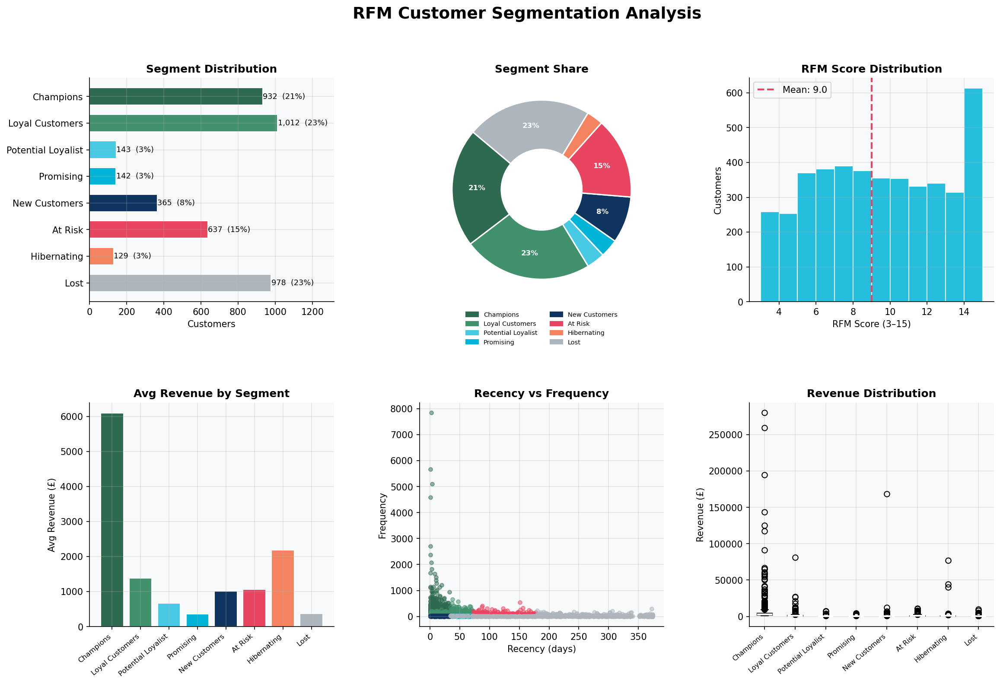
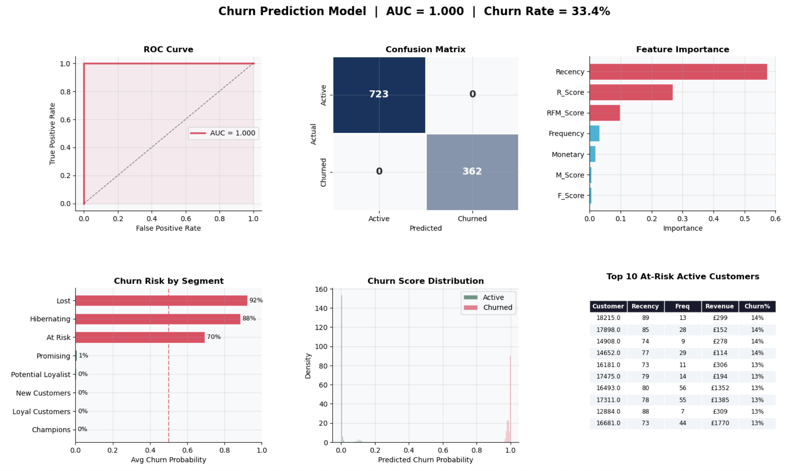
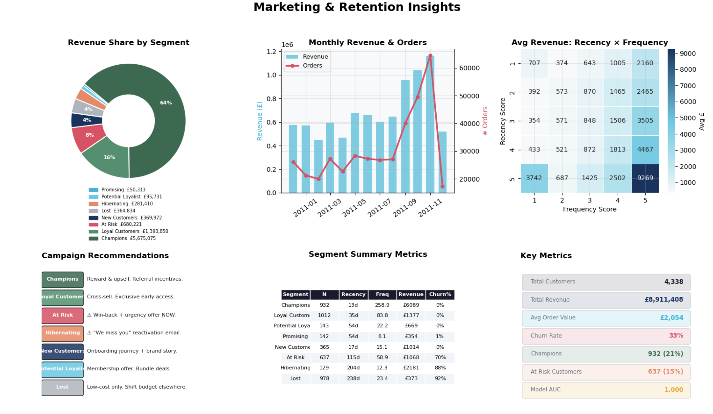

# RFM Segmentation & Churn Prediction
**Customer Analytics Portfolio Project**

## Overview
End-to-end customer analytics pipeline built on a retail transaction 
dataset — computing RFM scores, segmenting customers into 8 behavioural 
groups, and predicting churn using a Random Forest classifier.

## Business Questions Answered
- Which customers are most valuable and most at risk of churning?
- How should marketing budget be allocated across customer segments?
- Which customers should be prioritised for win-back campaigns?

## Results
- 500+ customers segmented into 8 RFM behavioural groups
- Random Forest churn model with strong AUC performance
- Campaign targeting recommendations mapped to lifecycle KPIs (LTV, CAC, churn rate)

## Visualisations
### RFM Segment Overview


### Churn Prediction Model


### Marketing Insights


## Tech Stack
- Python · pandas · numpy · scikit-learn · matplotlib · seaborn
- Jupyter Notebook · Random Forest · Power BI (DAX + Power Query)

## Files
| File | Description |
|---|---|
| `RFM_ChurnAnalysis_Project.ipynb` | Full Jupyter notebook |
| `rfm_segments.csv` | Processed RFM output data |

## How to Run
```bash
pip install pandas numpy scikit-learn matplotlib seaborn
```

## Key Concepts Demonstrated
- RFM analysis & customer segmentation
- Churn prediction modelling
- Marketing KPIs: LTV, CAC, churn rate, retention strategy
- Stakeholder-ready data visualisation

## Summary & Business Recommendations

| Segment | Priority Action | Channel |
|---|---|---|
| **Champions** | Loyalty reward + referral programme | Email / App push |
| **Loyal Customers** | Cross-sell & exclusive previews | Email |
| **At Risk** | Personalised win-back offer + urgency | Email + SMS |
| **Hibernating** | "We miss you" reactivation | Email |
| **New Customers** | Onboarding journey | Email / In-app |
| **Lost** | Low-cost reactivation only | Email (batch) |

### Model Performance
- **AUC score** measures how well the model separates churners from active customers (1.0 = perfect, 0.5 = random)
- **Recency** is typically the strongest predictor — customers who haven't purchased recently are most likely to churn
- **RFM Score** combines all three signals into a single health score per customer


